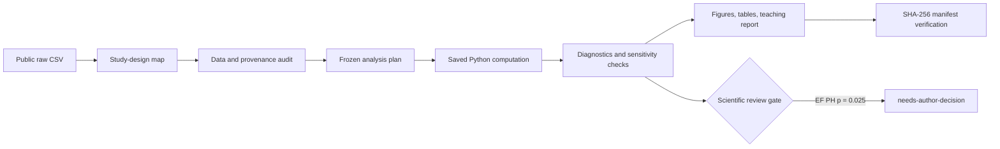

<div align="center">

**English** · [中文](DEMO.zh-CN.md)

# StatMate in 60 seconds

### One public CSV becomes an auditable statistical review package.

Study design · data audit · frozen plan · saved computation · diagnostics · figures · tables · teaching report · verified manifest

</div>


> **Reference-run status:** Automated QA **PASS** · SHA-256 manifest **33/33 verified** ·
> Scientific review **needs-author-decision**

This walkthrough uses the public UCI Heart Failure Clinical Records cohort. It is a transparent
demonstration of the workflow, not a clinical tool and not a numerical reproduction of every result
in the source papers.

| Cohort | Observed events | Review package | Figure export |
|:---:|:---:|:---:|:---:|
| **299 patients** | **96 deaths** | **3 figures + 2 tables + report** | **600 DPI + vector PDF** |

## The evidence route



## 1. Keep time and censoring visible


The prespecified ejection-fraction groups had different observed survival curves (overall log-rank
*p*<0.001). The figure keeps confidence bands, censoring marks, and numbers at risk together so the
late tail is not read without its shrinking information base.

**Boundary:** this is an observational prognostic association. It is not evidence that an EF
threshold causes a treatment effect.

## 2. Put the diagnostic beside the estimate


The prespecified Cox model reports effect size and uncertainty in clinically interpretable units:
EF per +5 percentage points HR 0.79 (95% CI 0.72–0.87), and serum creatinine per +1 mg/dL HR 1.36
(95% CI 1.18–1.55). Model C-index was 0.73.

> **Why the package is not marked final:** the EF covariate-level proportional-hazards diagnostic
> was *p*=0.025. A global diagnostic and graphical residual review remain pending. StatMate keeps
> the Cox assets at `needs-author-decision` instead of turning a technical run into scientific sign-off.

## 3. Label exploratory prediction as exploratory


Repeated five-fold out-of-fold validation gave AUC 0.766 (SD 0.061) for the full baseline model and
0.757 (SD 0.063) for creatinine + EF. Follow-up time is excluded to prevent leakage.

**Boundary:** similar internal AUCs do not prove model equivalence, external validity, clinical net
benefit, or deployment safety. The binary endpoint also compresses unequal follow-up.

## What the one-command run writes

| Layer | Inspect it |
|---|---|
| Design map | [`01_intake/study_design.md`](examples/heart-failure-survival/v2_demo/01_intake/study_design.md) |
| Data and provenance audit | [`02_audit/`](examples/heart-failure-survival/v2_demo/02_audit/) |
| Frozen analysis plan | [`03_plan/analysis_plan.md`](examples/heart-failure-survival/v2_demo/03_plan/analysis_plan.md) |
| Rerunnable computation | [`04_code/run_demo.py`](examples/heart-failure-survival/v2_demo/04_code/run_demo.py) |
| Machine-readable results | [`05_results/`](examples/heart-failure-survival/v2_demo/05_results/) |
| Figures, tables, and report | [`06_final/`](examples/heart-failure-survival/v2_demo/06_final/) |
| Automated QA | [`validation_report.md`](examples/heart-failure-survival/v2_demo/06_final/validation_report.md) |
| File lineage | [`manifest.json`](examples/heart-failure-survival/v2_demo/06_final/manifest.json) |

The demo keeps stable package paths under `06_final/`; readiness is controlled by the explicit
asset and package review states. The current package-level state is `needs-author-decision`.

## Reproduce it

From the repository root:

```bash
python -m venv .venv
# Windows
.venv\Scripts\python -m pip install -r statmate\requirements-demo.txt
.venv\Scripts\python examples\heart-failure-survival\v2_demo\04_code\run_demo.py

# macOS / Linux
.venv/bin/python -m pip install -r statmate/requirements-demo.txt
.venv/bin/python examples/heart-failure-survival/v2_demo/04_code/run_demo.py
```

Verify the checked-in package without rerunning the analysis:

```bash
python statmate/scripts/analysis_manifest.py verify \
  examples/heart-failure-survival/v2_demo/06_final/manifest.json
```

## Open the full handoff

- [Illustrated Word report](examples/heart-failure-survival/v2_demo/06_final/Heart_Failure_v2_Report.docx)
- [Visually checked PDF snapshot](examples/heart-failure-survival/v2_demo/06_final/Heart_Failure_v2_Report.pdf)
- [Full bilingual demo documentation](examples/heart-failure-survival/v2_demo/README.md)
- [Back to the project README](README.md)

The source cohort is observational, single-centre, small, and has no external validation cohort.
StatMate supports review; authors remain responsible for statistical, scientific, and clinical sign-off.
