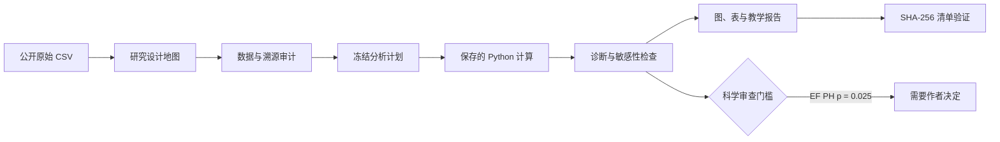

<div align="center">

[English](DEMO.md) · **中文**

# 60 秒看懂 StatMate

### 一份公开 CSV，变成一套可审计的统计审阅包。

研究设计 · 数据审计 · 冻结计划 · 保存代码 · 模型诊断 · 图表 · 教学报告 · 哈希验证

</div>


> **参考运行状态：** 自动 QA **PASS** · SHA-256 清单 **33/33 验证通过** ·
> 科学审查 **needs-author-decision（需要作者决定）**

这个演示使用公开的 UCI 心力衰竭临床记录队列。它展示的是一条透明、可复核的分析
工作流，不是临床工具，也不是对来源论文全部结果的逐项数值复刻。

| 队列 | 观察事件 | 审阅包 | 图像导出 |
|:---:|:---:|:---:|:---:|
| **299 例患者** | **96 例死亡** | **3 图 + 2 表 + 报告** | **600 DPI + 矢量 PDF** |

## 证据路径



## 1. 保留时间与删失信息


预设射血分数组别的观察生存曲线存在差异（整体 log-rank *p*<0.001）。图中同时保留
置信带、删失标记与风险人数，避免脱离后期样本量去解读曲线尾部。

**结论边界：**这是观察性预后关联，不能据此认定某个 EF 阈值造成了治疗效应。

## 2. 让模型诊断紧挨效应估计


预设 Cox 模型用临床可解释增量同时报告效应与不确定性：EF 每增加 5 个百分点的 HR
为 0.79（95% CI 0.72–0.87）；血清肌酐每增加 1 mg/dL 的 HR 为 1.36（95% CI
1.18–1.55）。模型 C-index 为 0.73。

> **为什么整包没有标成 final：** EF 的协变量级比例风险诊断 *p*=0.025；整体诊断与
> 图形残差审查仍待完成。StatMate 因此把 Cox 资产标为 `needs-author-decision`，不会把
> “代码成功运行”冒充为“科学审核通过”。

## 3. 把探索性预测明确写成探索性


重复五折折外验证中，完整基线模型 AUC 为 0.766（SD 0.061），肌酐 + EF 模型为
0.757（SD 0.063）。随访时间已排除，以避免信息泄漏。

**结论边界：**相近的内部 AUC 不等于模型等效、外部有效、具有临床净获益或可安全部署；
二分类结局还压缩了不等随访信息。

## 一条命令会生成什么

| 层级 | 查看内容 |
|---|---|
| 研究设计地图 | [`01_intake/study_design.md`](examples/heart-failure-survival/v2_demo/01_intake/study_design.md) |
| 数据与溯源审计 | [`02_audit/`](examples/heart-failure-survival/v2_demo/02_audit/) |
| 冻结分析计划 | [`03_plan/analysis_plan.md`](examples/heart-failure-survival/v2_demo/03_plan/analysis_plan.md) |
| 可重复运行的代码 | [`04_code/run_demo.py`](examples/heart-failure-survival/v2_demo/04_code/run_demo.py) |
| 机器可读结果 | [`05_results/`](examples/heart-failure-survival/v2_demo/05_results/) |
| 图、表与报告 | [`06_final/`](examples/heart-failure-survival/v2_demo/06_final/) |
| 自动质量检查 | [`validation_report.md`](examples/heart-failure-survival/v2_demo/06_final/validation_report.md) |
| 文件溯源 | [`manifest.json`](examples/heart-failure-survival/v2_demo/06_final/manifest.json) |

演示为保持路径稳定，仍将产物放在 `06_final/`；真正决定是否可交付的是每项资产与整包
的显式审查状态。当前整包状态为 `needs-author-decision`。

## 一键复现

在仓库根目录运行：

```powershell
python -m venv .venv
.venv\Scripts\python -m pip install -r statmate\requirements-demo.txt
.venv\Scripts\python examples\heart-failure-survival\v2_demo\04_code\run_demo.py
```

不重跑分析，仅验证当前清单：

```powershell
python statmate\scripts\analysis_manifest.py verify `
  examples\heart-failure-survival\v2_demo\06_final\manifest.json
```

## 打开完整交付包

- [图文 Word 报告](examples/heart-failure-survival/v2_demo/06_final/Heart_Failure_v2_Report.docx)
- [已经逐页检查的 PDF 快照](examples/heart-failure-survival/v2_demo/06_final/Heart_Failure_v2_Report.pdf)
- [完整双语 Demo 文档](examples/heart-failure-survival/v2_demo/README.md)
- [返回项目中文首页](README.zh-CN.md)

来源队列是单中心、小样本观察性数据，且没有外部验证队列。StatMate 提供可审阅的分析
支持；统计、科研与临床层面的最终签字仍由作者负责。
