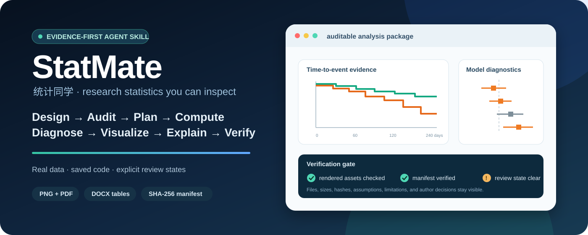
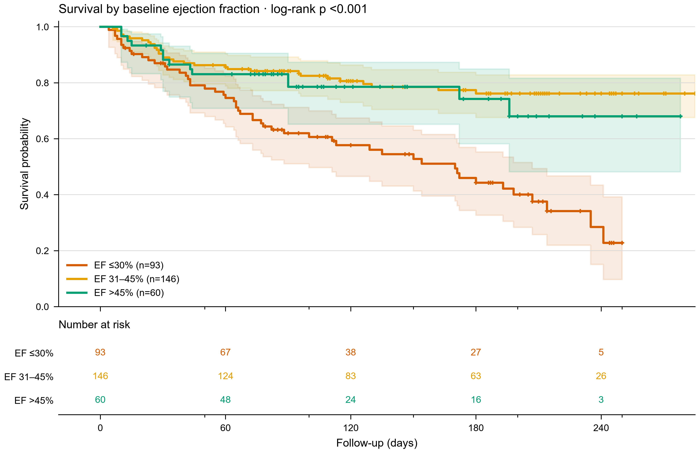
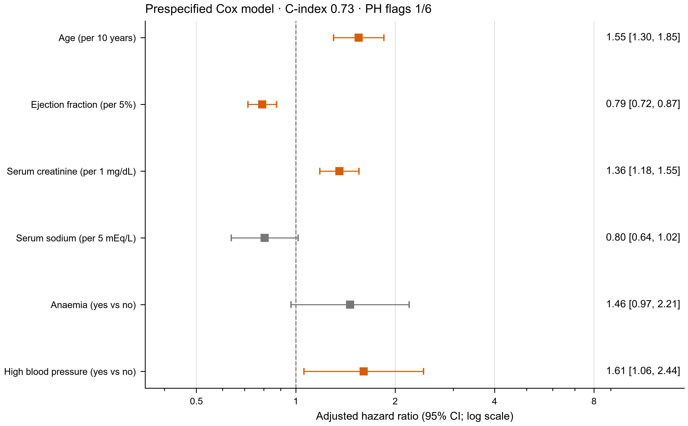
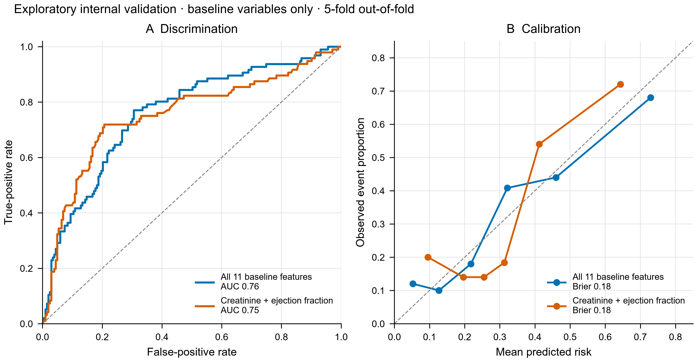

<div align="center">

**English** · [中文](README.zh-CN.md)

# 📊 StatMate（统计同学）

### Evidence-first statistical workflows for research agents.

[](statmate/SKILL.md)
[](https://github.com/DRZ-hang/StatMate/actions/workflows/statmate-tests.yml)
[](https://www.python.org/)
[](LICENSE)

</div>



<p align="center">
  <a href="DEMO.md"><strong>▶ Open the 60-second demo</strong></a>
  · <a href="examples/heart-failure-survival/v2_demo/">inspect the full audit trail</a>
  · <a href="statmate/SKILL.md">read the skill</a>
</p>

> **Reference demo status:** Automated QA **PASS** · Manifest **33/33 verified** · Scientific
> review **needs-author-decision**

**StatMate** (Chinese: **统计同学**, formerly paper-figures) is an **Agent Skill** for biomedical and
other quantitative research. Its workflow turns a manuscript, protocol, data dictionary, and real
data into a study-design map, a data audit, and a reviewable statistical analysis plan. After the
material decisions are resolved, saved code computes the statistics, runs diagnostics, and builds
figures, tables, and a teaching report. The workflow requires every reported value to remain
traceable to source data, machine-readable results, and the script that produced it.

---

## ✨ Highlights

- 🛡️ **Real computation, not generated images** — figures come from statistical analysis and plotting code run on your raw data. The pipeline uses no generative image model, so results are traceable, reproducible, and stay clear of the AI image-generation line.
- 🔬 **Data-first & explicit** — bar charts use an honest zero baseline; transformed axes are labelled;
  sample sizes, uncertainty definitions, and computed p-values remain visible.
- 🧭 **Design before tests** — establish the question, analysis unit, dependence, outcome,
  covariates, and estimand before selecting a method.
- 🔎 **Data audit + approval gate** — check missingness, duplicates, pseudoreplication, empty design
  cells, privacy risks, and model estimability before formal computation.
- 📈 **Chart and method decision support** — a built-in guide maps data shape, study design, estimand,
  and scientific claim to defensible options; the author still reviews the choice.
- 🎓 **Journal-style starting presets** — configurable family presets (Nature / Science / Cell / IEEE / Elsevier / PLOS + a generic default) for widths, fonts, dpi, and colorblind-safe palettes. Verify the exact journal's live rules before submission.
- 🧬 **A practical default pair** — an immediate PNG preview plus a vector-oriented PDF;
  substitute SVG or add venue-specific formats only when requested.
- 📐 **Tables exported after review** — Word three-line table by default; Excel, CSV, or LaTeX only
  when requested.
- 🧑‍🏫 **Interpretation + reading instruction** — explain the effect, uncertainty, relevance, and
  limits, then teach the user how to inspect each mark, interval, row, column, and footnote.
- 🌏 **Talk to StatMate in your language** — it replies in the language you use while leaving the
  manuscript language unchanged unless you ask for translation or localization.
- 🧰 **Core plus optional stacks** — matplotlib and seaborn in the core profile; plotnine, plotly,
  lifelines, and scikit-learn are available through optional dependency profiles.
- ♻️ **Auditable reproducibility** — fixed seeds, saved scripts, machine-readable results, recorded
  versions, file hashes, and a manifest verification step.

---

## 🖼 See it in action

The repository contains one **auditable reference workflow** and one **visual gallery**, both built
from openly licensed research data. No scientific marks in the figures below were generated or
redrawn by an image model.

### 🫀 Auditable reference workflow — heart-failure prognosis

**Design map · data audit · frozen plan · Kaplan–Meier · Cox diagnostics · internal prediction ·
teaching report · verified manifest**

[▶ 60-second walkthrough](DEMO.md) ·
[full audit trail](examples/heart-failure-survival/v2_demo/) ·
[illustrated DOCX](examples/heart-failure-survival/v2_demo/06_final/Heart_Failure_v2_Report.docx) ·
[visually checked PDF](examples/heart-failure-survival/v2_demo/06_final/Heart_Failure_v2_Report.pdf)



| Adjusted Cox model — review decision pending | Exploratory out-of-fold prediction |
|:---:|:---:|
|  |  |

> Automated checks pass and the manifest verifies 33/33 files. The package remains
> `needs-author-decision` because the EF proportional-hazards diagnostic is flagged and global plus
> graphical review is pending.

### 🐧 Visual gallery — Antarctic penguins

**9 figures across 9 chart families + 3 three-line tables** ·
[explore the gallery](examples/penguins-sexual-dimorphism/) ·
[open the report](examples/penguins-sexual-dimorphism/Figure_Report.docx)

| Scatter + regression | Raincloud | PCA biplot |
|:---:|:---:|:---:|
|  |  |  |
| **Correlation heatmap** | **Histogram + ECDF** | **Forest plot** |
|  |  |  |

---

## 🎯 The 9-stage workflow

The skill is a disciplined workflow, not a one-shot prompt — the same path a careful analyst takes.

| | Stage | What happens |
|---|---|---|
| 1️⃣ | **Design map** | Extract the question, analysis unit, endpoints, timing, and claim boundary. |
| 2️⃣ | **Data/provenance audit** | Check structure, missingness, duplicates, privacy, design cells, and source hashes. |
| 3️⃣ | **Analysis plan** | Specify estimands, methods, assumptions, diagnostics, effects, and multiplicity. |
| 4️⃣ | **Approval gate** | Resolve author decisions that materially change the analysis. |
| 5️⃣ | **Code computation** | Run saved code and write machine-readable results first. |
| 6️⃣ | **Diagnostics/sensitivity** | Challenge model fit, robustness, and multiple testing. |
| 7️⃣ | **Build and inspect** | Generate PNG + PDF, review table content, and verify rendered assets. |
| 8️⃣ | **Interpret and teach** | Provide scientific interpretation, manuscript wording, and a reading guide. |
| 9️⃣ | **Final export** | After approval, output only requested table/report formats and the manifest. |

---

## 💪 From ad hoc plotting to an evidence workflow

| Layer | Ad hoc plotting | **StatMate workflow** |
|---|---|---|
| Starting point | a requested chart | **study design, estimand, and real data** |
| Method choice | selected while plotting | **written into a reviewable plan first** |
| Computation | results may live only in a notebook | **saved code + machine-readable results** |
| Diagnostics | separate or omitted | **model assumptions and sensitivity checks stay beside the result** |
| Visual QA | appearance review | **appearance review plus automated canvas, DPI, and file checks** |
| Scientific state | implicit | **draft / needs-author-decision / approved / final** |
| Handoff | image files | **review package + selected exports + report + verified manifest** |

---

## 🌐 Language

Talk to StatMate in whichever language is most comfortable for you. It replies in the language you
use by default. This changes the conversation only: your manuscript and submission materials stay
in their existing language (for example, an English manuscript stays in English) unless you
explicitly ask StatMate to translate or adapt them for a local-language journal.

The heart-failure reports below show English, Chinese, and bilingual output variants. They are
examples, not a limit on the languages you can use with StatMate:
[in English](examples/heart-failure-survival/Figure_Report_EN.docx),
[bilingual](examples/heart-failure-survival/Figure_Report.docx), and
[in Chinese](examples/heart-failure-survival/Figure_Report_ZH.docx).

---

## 🚀 Install & deploy

The `statmate/` folder is designed as a portable, folder-based **Agent Skill**: `SKILL.md`, Python
helpers, references, and assets travel together. Skill installation and trigger conventions vary by
agent, so use the destination agent's current documentation for placement.

**1. Get the skill:**

```bash
git clone https://github.com/DRZ-hang/StatMate.git
```

**2. Put the `statmate/` folder where your agent looks for skills:**

- **Claude Code** — `~/.claude/skills/` (all projects) or a project's `.claude/skills/`:
  ```bash
  cp -r StatMate/statmate ~/.claude/skills/statmate
  # Windows PowerShell:
  # Copy-Item -Recurse StatMate\statmate $env:USERPROFILE\.claude\skills\statmate
  ```
- **OpenAI Codex** — copy the folder into Codex's skills directory (see your Codex setup's skills docs for the exact path).
- **Other skill-capable agents** — drop the same `statmate/` folder into that agent's skills location. Because the skill is just `SKILL.md` + scripts, one folder works everywhere; only the destination directory differs per agent.

**3. Install the Python dependencies:**

```bash
pip install -r statmate/requirements.txt       # core helpers
pip install -r statmate/requirements-all.txt   # optional full plotting/statistics stack
```

Once installed, invoke it explicitly with `$statmate`, or let it trigger when you ask for research
statistics, figures, tables, interpretation, or a figure-reading guide.

> Run `python statmate/scripts/figstyle.py --list` to see the bundled journal presets.

---

## 📝 Usage

Just describe the task to your agent with your manuscript and data at hand:

> - *"Here's my manuscript and `results.xlsx` — make the figures for the Results section, formatted for Nature, captions in English."*
> - *"为这篇论文的实验数据画一张分组比较图,目标期刊是 IEEE 双栏,图注用中文。"*
> - *"Turn `cohort.csv` into a Kaplan–Meier figure and a baseline characteristics table (三线表), bilingual report."*
> - *"Here are my protocol, data dictionary, and `results.xlsx`. Recommend and explain the
>   statistical plan first; run it only after I approve it."*

Your agent maps the study design, audits the data, and presents an analysis plan for approval.
It then runs code, diagnoses the model, builds the figures/tables, and explains both the result and
how to read it. Final table formats are chosen only after review.

---

## 📦 What's in the box

```
statmate/                           ← the skill (install this folder)
├── SKILL.md                       ← the workflow the agent follows
├── requirements.txt              ·  core helpers and common analyses
├── requirements-demo.txt         ·  dependencies for the reference demo
├── requirements-all.txt          ·  optional full plotting/statistics stack
├── requirements-test.txt         ·  CI and development checks
├── references/                    ← decision guides loaded on demand
│   ├── study-design-intake.md     ·  research question and design map
│   ├── data-audit-and-provenance.md · quality, privacy, and lineage
│   ├── analysis-plan.md           ·  analysis plan and approval gate
│   ├── statistical-methods.md     ·  general statistical methods
│   ├── biomedical-methods.md      ·  biomedical analysis routing
│   ├── chart-selection.md         ·  data shape × claim → chart type
│   ├── interpretation-and-teaching.md · interpretation and reading guide
│   ├── journal-specs.md           ·  venue requirements and presets
│   └── plotting-stacks.md         ·  publication plotting idioms
├── scripts/
│   ├── data_audit.py              ·  JSON + Markdown data audit
│   ├── analysis_manifest.py       ·  hashes and reproducibility manifest
│   ├── figstyle.py                ·  PNG preview + PDF/SVG vector
│   ├── table_export.py            ·  reviewed on-demand table export
│   ├── docx_tables.py             ·  three-line (三线表) Word tables
│   └── report_docx.py             ·  assemble the report (lang = en / zh / bilingual)
└── assets/
    ├── presets.json               ·  editable journal presets
    └── report_template.md         ·  Markdown report fallback

statmate/tests/                     ← unit and integration regression tests

examples/                          ← two full worked examples (data + scripts + figures + reports)
├── penguins-sexual-dimorphism/    ·  9 chart families, 3 tables
└── heart-failure-survival/        ·  v2 audited survival / Cox / prediction demo + legacy showcase
```

---

## 🔬 Reproducibility

Every figure and table in this repo is produced by saved code. The heart-failure demo records the
direct package versions used for its reference run and verifies every generated file immediately.
The same environment can reproduce machine-readable results and raster assets, but fonts, numerical
libraries, and PDF/DOCX metadata can vary across systems. Inspect content and refresh the manifest
after each run rather than assuming byte-identical output across environments.

```bash
cd examples/penguins-sexual-dimorphism/scripts
for f in make_*.py; do python "$f"; done   # regenerates every figure, table & the report

# pick a report language for the heart-failure example:
cd ../../heart-failure-survival/scripts
STATMATE_LANG=en python make_report.py      # or zh / bilingual; PAPERFIG_LANG remains supported

# run the complete v2 evidence workflow instead:
cd ..
python v2_demo/04_code/run_demo.py

# independently verify its hashes after a transfer or later review:
cd ../..
python statmate/scripts/analysis_manifest.py verify examples/heart-failure-survival/v2_demo/06_final/manifest.json
```

---

## ⚠️ Disclaimer

StatMate assists with analysis and figure/table production from your data; it does not
replace scientific judgement. Research publishing demands rigour, and the authors of the paper
remain fully responsible for the work. Before using or submitting any figure or table, have the
authors review the statistical methods, the chart choices, the underlying numbers, and the wording
of every caption for professional correctness and accuracy. Treat the output as a well-prepared
draft to verify, and sign off on it only after that expert review.

---

## 📄 License & data attribution

This project's **code** is released under the [MIT License](LICENSE).

The two worked examples are built entirely from **other researchers' published, openly-licensed
data**. All credit for the data belongs to the original authors below — please keep this
attribution if you reuse the examples.

### 🐧 Example 1 — Antarctic penguins
> **Paper (CC BY 4.0):** Gorman KB, Williams TD, Fraser WR (2014). *Ecological Sexual Dimorphism
> and Environmental Variability within a Community of Antarctic Penguins (Genus Pygoscelis).*
> **PLOS ONE** 9(3): e90081. https://doi.org/10.1371/journal.pone.0090081
>
> **Data (CC0):** collected by Dr. Kristen Gorman and the Palmer Station Antarctica LTER
> (PAL-LTER); distributed via the `palmerpenguins` R package — Horst AM, Hill AP, Gorman KB
> (2020). https://allisonhorst.github.io/palmerpenguins/ · doi:10.5281/zenodo.3960218

### 🫀 Example 2 — Heart-failure survival
> **Paper (CC BY 4.0):** Chicco D, Jurman G (2020). *Machine learning can predict survival of
> patients with heart failure from serum creatinine and ejection fraction alone.* **BMC Medical
> Informatics and Decision Making** 20: 16. https://doi.org/10.1186/s12911-020-1023-5
>
> **Original data collection:** Ahmad T, Munir A, Bhatti SH, Aftab M, Raza MA (2017). *Survival
> analysis of heart failure patients: A case study.* **PLOS ONE** 12(7): e0181001.
> https://doi.org/10.1371/journal.pone.0181001
>
> **Dataset (CC BY 4.0):** UCI Machine Learning Repository, *Heart failure clinical records*
> (dataset 519). https://archive.ics.uci.edu/dataset/519/heart+failure+clinical+records

Per-example details and license notes: [penguins](examples/penguins-sexual-dimorphism/README.md#source--attribution--来源与署名)
· [heart failure](examples/heart-failure-survival/README.md#source--attribution--来源与署名).

<div align="center">

**Designed for OpenAI Codex, Claude Code, and other folder-based skill workflows.** If this helps
your research, a ⭐ helps other researchers discover it.

</div>
